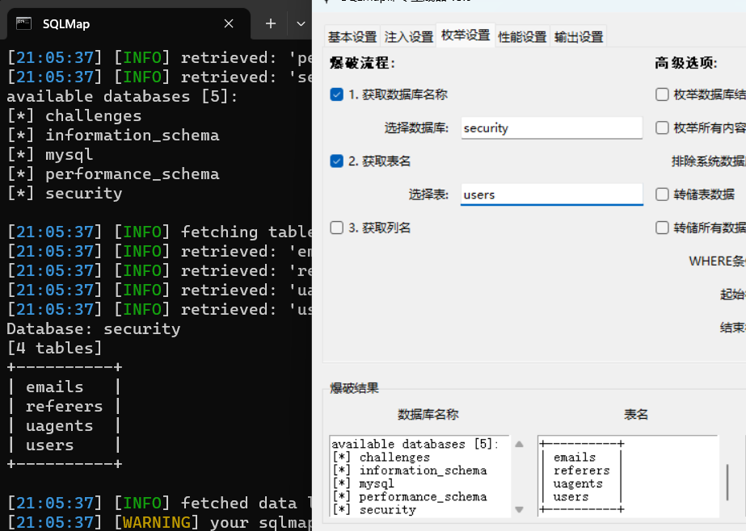

# SQLMap_Command_Generator_SimpleVersion_CN
**爱来自kimi,Deepseek**  
SQLMap命令生成器（简单版）。  
**Windows版本。**  
用Linux也不是不可以.......  
更适合东大宝宝的命令生成器。  
在kimi和Deepseek指导下写的简易玩意儿，最大的好处是不用一个一个敲代码。  
使用前请确保有tkinter库。下载此库，请使用:

    pip install tkinter  
    
所以，有什么问题建议用kimi or deepseek解决，当然，你自己也可以把它变得更好。
### 最新版本

[√] V3.1        #添加了SQLMap的启动路径，方便更快在SQLMap上面启动。

[√] V3.1_EN     #英文版V3.1。

[√] V3.0不支持直接启动sqlmap，但是它依旧可用。

左边框可以粘贴爆破出来的数据库，右边的框可以放某一个（或所有）的数据库的表。

~~大致过程：~~

   ~~爆出库名——>在"选择数据库"的框里面粘贴上你选中的库名，勾选"获取表名"——>爆破出表;~~
   ~~爆出表名——>在"选择表"的框里面粘贴上你选中的列名，勾选"获取列名"——>爆破表的列名。~~

爆破流程：

首先，我们在获取”数据库名称“这里记得勾选上:


当爆出数据库的时候，我们可以把爆破出来的数据库名放在**爆破结果**的**数据库名称**栏。以免后续sqlmap的信息多，很烦，懒得往上翻。单独粘贴到一个栏好看。


然后，我们可以在**爆破结果**的**数据库名称**栏选一个数据库，粘到当前‘数据库’那个方框里；点击生成命令，然后把命令复制下来运行


获取某一个数据库的表的名称和某一个表里面某一个列的名称也是同样的操作。


请注意。如果想dump数据库查看详细情况，请在爆破出列后面加上-dump:
```
例如：
python sqlmap.py -u "http://127.0.0.1:8002/Less-1/?id=1" --batch --dbs -D security --tables -D security -T users --columns -dump
```


至于dump命令，自己整（才不是我懒得加）。  
啊，记得命令生成后自己复制，**ctrl+c**即可。  
**注意！！注意！！**
**本工具仅供安全测试人员运用于授权测试, 禁止用于未授权测试, 违者责任自负。作者不对您使用该工具所产生的任何后果负任何法律责任。**  

此工具接下来可能，仅仅是**可能，会不定时、不定期更新**。所以，请各位师傅们尽情二开吧。  
请师傅们使用本工具的同时，不妨点个star,这对我有非常大的帮助。谢谢了！

# 致谢：
- **kimi**
- **Deepseek**
- **QQ好友 @feng-none**
- **[SQLmap的使用](https://blog.csdn.net/weixin_52180702/article/details/125506890)**


# License
This project is licensed under the Creative Commons Attribution-NonCommercial-ShareAlike 4.0 International License (CC BY-NC-SA 4.0). You are free to use, modify, and distribute this code, but you must give appropriate credit, provide a link to the license, and indicate if changes were made. You may not use this code for commercial purposes. If you remix, transform, or build upon this material, you must distribute your contributions under the same license as the original.

[See the full license here](https://creativecommons.org/licenses/by-nc-sa/4.0/)


